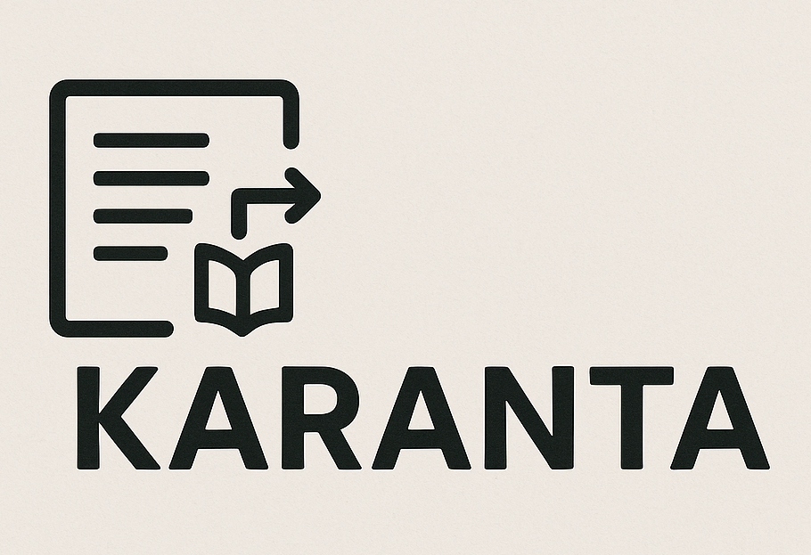

<div align="center">

<br/>
  <br>
  <h1>Karanta OCR</h1>
</div>

# Karanta OCR
Karanta means "read" in Hausa, a language spoken in Nigeria and other West African countries. This project is a OCR toolkit for processing scanned documents containing content in african languages and extracting the text in them at scale.

We would like to give huge credits to the [OlmoOCR](https://github.com/allenai/olmocr) project and team for providing that we've for Karanta.

## OCR Pipeline

### Document Type Classification
...

### Document Article Segmentation
...

### OCR
...


## Setup

Our repository uses uv environment to manage dependencies. To set up the environment, follow these steps:

- Install uv by [following the instrictions here](https://docs.astral.sh/uv/getting-started/installation/)
- Create a new uv environment and install the dependencies:
  ```bash
  uv venv
  source .venv/bin/activate
  ```
- Install dependencies:
  ```bash
  uv sync
  ```


## License
...

## Citing
